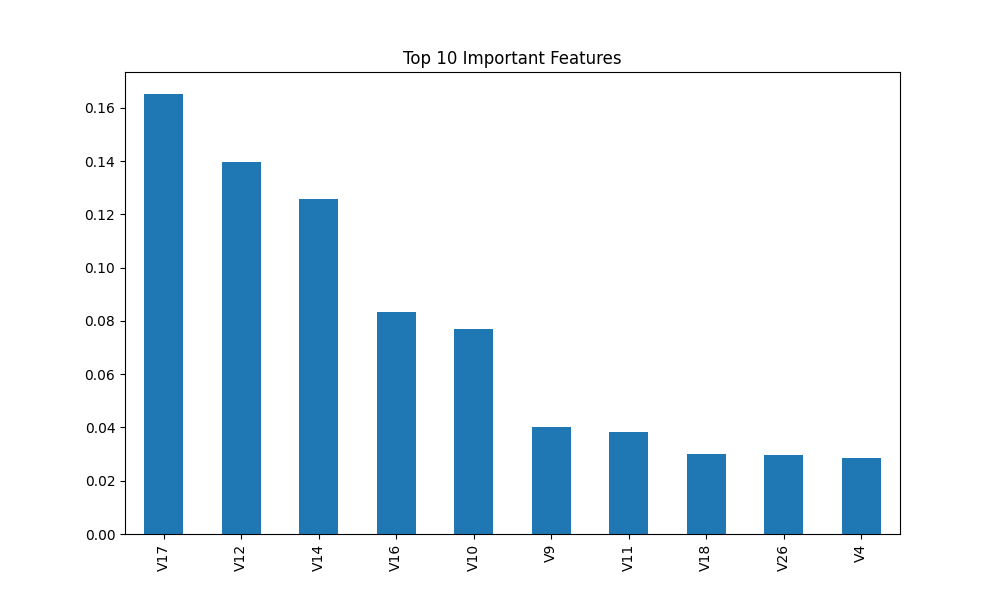

# Credit Card Fraud Detection using Random Forest

This project builds a machine learning system to detect fraudulent credit card transactions.
Fraud detection is a real-world problem where the dataset is highly imbalanced and traditional
accuracy metrics are misleading.

---

## Problem Statement

Credit card fraud occurs when unauthorized transactions are made using someone’s card.
The goal of this project is to identify such transactions as early as possible.

This is challenging because:
- Fraud cases are extremely rare.
- Most transactions are normal.
- The dataset is highly imbalanced.

---

## Dataset

The original dataset is provided by Kaggle:

https://www.kaggle.com/datasets/mlg-ulb/creditcardfraud

The full dataset is very large (~150MB), so it cannot be uploaded to GitHub directly.

For this repository, a smaller sample of the dataset is used:

This sample preserves the original data distribution and is sufficient for
demonstrating model training and evaluation.

---

## Workflow

1. Load and inspect dataset  
2. Analyze class imbalance  
3. Split data using stratification  
4. Train baseline Logistic Regression  
5. Train Random Forest model  
6. Compare models using precision, recall, F1-score  
7. Plot feature importance  
8. Save trained model  

---

## Why Random Forest?

Random Forest is an ensemble model that combines multiple decision trees.
It performs well on non-linear patterns and is robust for imbalanced problems.

---

## Why Accuracy is Not Used

In fraud detection:
- Predicting everything as "normal" gives very high accuracy.
- But it fails to detect fraud.

So we focus on:
- Precision
- Recall
- F1-score

These metrics better reflect real-world performance.

---

## Files in this Repository

| File | Description |
|------|------------|
| CreditCardFraud_RandomForest.ipynb | Main notebook with full pipeline |
| creditcard_sample.csv | Sample dataset used for training |
| feature_importance.png | Top important features |
| fraud_model.pkl | Saved trained model |
| README.md | Project documentation |

---

## Tools Used

- Python  
- Pandas  
- NumPy  
- Scikit-learn  
- Matplotlib  
- Joblib  
- Google Colab  

---

## Key Learning Outcomes

- Handling imbalanced datasets  
- Comparing baseline vs ensemble models  
- Choosing correct evaluation metrics  
- Model interpretability using feature importance  
- Saving models for deployment  

## Top 10 Important Features

---

## Note on Dataset Usage

The full dataset should be downloaded from Kaggle if you want to run the model on the entire data.
This repository uses a sample dataset for size and reproducibility reasons.
